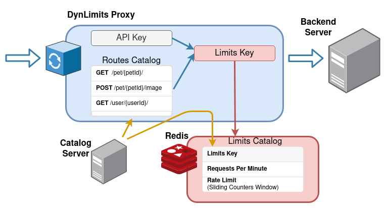
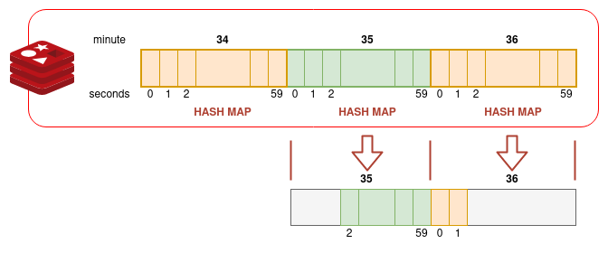

# DynLimits

**A proxy server to enforce per user/api key and endpoint rate limits.**

DynLimits allows to define different rate limits for each http verb
and endpoint that is defined.

, so do what you want with this but do not
blame me :)


## Overview



DynLimits works by loading into memory a **catalog of available
endpoints** (verb + path) to use, and loading into redis a **catalog of
per endpoint and api key** rate limit to apply.

The catalogs can be provided at startup time, but can also
be updated by polling a _Catalog Server_.

Another option to request a catalog update is sending an
a request with an special header that forces
to fetch updates from the catalog server.

The proxy is designed to have several instances running
concurrently, with the shared limits stored in a Redis instance.

You can have a look at a **draft example** in the
`examples/restatsrv` folder, where you can find a
[README.md with instructions](./examples/reqstatsrv/README.md)
to run the test.

## Configuration

Configuration is done through a JSON file (that maps to the
[`APIIndexedLimits`](./pkg/catalog/limitdefs.go) structure)
with the following sections:

#### `version`

The version fields can be found in
[`APICatalogVersion`](./pkg/catalog/limitdefs.go) structure, and contains
three fields:

- `semver` : A semantic version
- `hash` : the actual string used in internal code for comparison
- `released` : the RFC3339 timestamp for when this version was created

#### `methods`

A list of all the http verbs that will / can be used be the list of endpoints

#### `paths`

A list of all the paths that we want to limit, with variable parts of the
paths enclosed in brackets (like `/foo/{var}/bar`)

#### `endpoints`

The endpoints are a list of (http verb, path) pairs, that in order to
avoid repeating data are indices to the previous `paths` (`p` field)
and `methods` (`m` field) lists.

#### `apilimits`

This field has a list of structures that holds an API key with its limits.

Limits are a list of endpoint indices (`ep`) with its ratelimit value (`rl`).


#### Example configuration file

```json
{
    "version": {
        "semver": "v1.0.1",
        "hash": "a831829b8c92dfb92834",
        "released": "2020-04-12T23:20:50.52Z",
    },
    "methods": ["GET", "POST", "DELETE", "PUT", "PATCH", "HEAD", "OPTIONS"],
    "paths": [
        "\/api\/filipid\/recipients\/{recipient_id}\/preferences",
        "\/api\/filipid\/recipients"
    ],
    "endpoints": [
        {"p": 0, "m": 0},
        {"p": 1, "m": 0}
    ],
    "apilimits": [
        {
            "key": "7H6AMB0FXQKQBG3JKPW1PXTTNW",
            "limits": [
                { "ep": 0, "rl": 20 },
                { "ep": 1, "rl": 5 }
            ]
        }
    ]
}
```

## Middleware

### Rate limit algorithm: **Sliding Window Counters**

The algorithm is easy to implement (you can find an article about
[rate limiting at Figma](https://www.figma.com/blog/an-alternative-approach-to-rate-limiting/), and the approach here is pretty similar at what is described in its
"Sliding windows counters" section with some changes).

It is also based in the [very efficient hash map structure](https://redis.io/topics/memory-optimization). But instead of having a single hash map for each
Limits Key (in the article 'user') in DynLimits the **Limits Key
and minute are concatenated** to create the redis key, and a 3 minutes expiration
time (to allow for servers drifting a few seconds to still use the window).




When DynLimits wants to check the rate limits it only has to fetch
the hash map for the current minute and the previous one to reconstruct
the current counters window.


#### Alternatives

* [Token Bucket](https://en.wikipedia.org/wiki/Token_bucket): To implement
    with redis, we need some lua logic in the redis server: we need
    a single service that takes care of adding tokens to the keys, and
    we need to increment "with saturation" (with a max upper limit to
    "top" the token bucket), something that is by now not supported
    by `INCR` / `INCRBY`.

* [Redis rate limit examples](https://redis.io/commands/incr#pattern-rate-limiter-1).


### The Path Matcher

The **DynLimits** have a single shared path matcher structure, that is
local to the instance.

At server startup it is loaded with the initial configuration. However,
it also can launch an "updates poller", that can check redis and an
a "_control_" server for updates.


#### The Updated Poller

There are three GET endpoints that a control server must support:

- `/latest` : to fetch the full catalog (**TODO**).
- `/catalog_diff` : to get the differences from a previous
    catalog version (so it just gives a list of things to delete,
    and a list of things to add) (**TODO**).
- `/indexed_limits`: that, given that the endpoints catalog has not
    changed, can update limits for a set of api keys.

currently, only the last endpoint is used, to obtain an `APIIndexedLimits`
catalog, that is then passed to the `UpdateSharedMatcher` function
(in [./pkg/catalog/matcher.go](./pkg/catalog.matcher.go) file), and
then to `RedisUpdate` (in [


## How to adapt it to different use cases

### Not using an API but a userID

There can be the case that a given user/account can have severl API keys. If
we do not want to have a rate limit quota per api key but per user quota,
we need to create a middleware that converts any api key / cookie / auth
method, to a user / account unique ID , and puts that into the request
header.


### Requests per hour, instead of requests per minute

We can just use the timestampSecs modulo 60, and use that for the
sliding counters window. But that would mean that all use the same
"window".


### The Local API Key Catalog

**TODO**: this is a planned feature, that is not being used right now

This serves as an optimization to avoid having to fetch the sliding
window from redis, when we know that a key will need to wait several seconds
before is able to perform a new requests to that endpoint.
